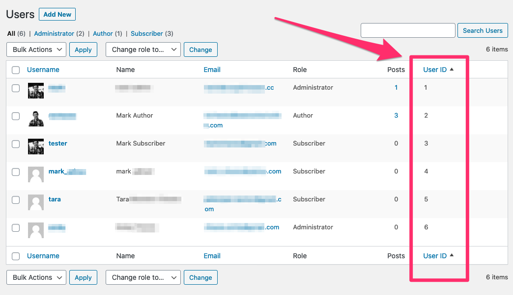

# caught my eye Sortable User ID Column Plugin

This WordPres plugin creates a custom sortable user ID column on the Users page.

This is helpful if you're using WordPress user ID tracking in Google Analytics and need to quickly lookup the user account details (e.g., name, login, etc.).

---

## Installation

1. Manually upload the **contents** of the [zip](cme-user-id-column.zip) file of this repo to /wp-content/plugins/ directory or upload the zip via your wp-admin **Plugins** > **Add New** > **Upload Plugin**.
2. Activate the plugin through the wp-admin **Plugins** page.

That's it!

---

## Usage

1. Log in to your WordPress /wp-admin/ area.
2. Go to the Users page.
3. View User ID column.
4. Click on the User ID column heading to sort the rows.

---

## Screengrab

